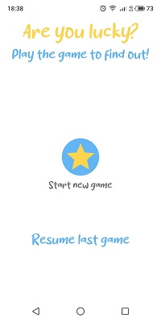
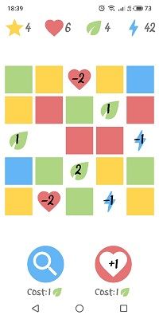
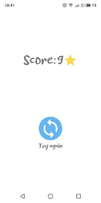

Mini game "Are you lucky?"

Приложение представляет собой мини игру с 3 экранами.

Игровое поле сделано на основе custom view.

В проекте использоавнны: MVVM как слой представления, room для сохранения незавершённой игры, hilt для di, coroutines для многопоточности.

APK файл можно скачать [здесь.](https://github.com/ChufarnovEvgeniy/are-you-lucky/blob/c3966d23de90858b87d2bd54bbd91f60ce2ca2b8/app/release/app-release.apk)
